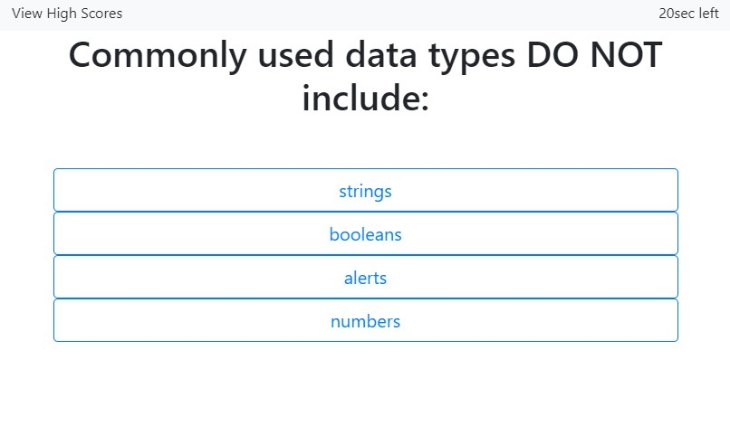
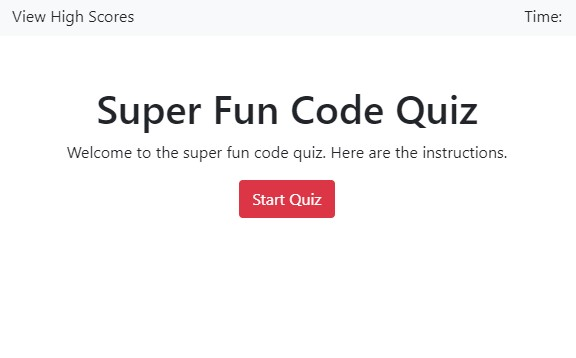
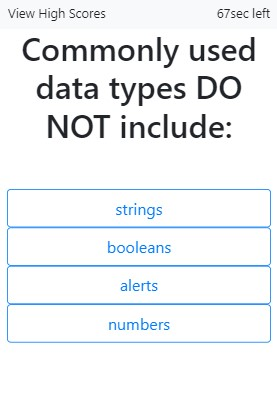
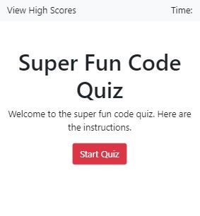

# Code Quiz

**Motivation**

This is a code quiz which tests a user's knowledge of basic JavaScript concepts. The application was built as part of a project for the UCSD web development bootcamp program. The quiz is multiple-choice and relies on a timer to determine how well the user performs when taking the quiz. The timer starts after the start button is clicked. Counting down from 75 seconds every time the user submits the wrong answer, 15 seconds are deducted from the countdown clock. The application also uses local storage to store the user's score to the browser so that when the user returns, they can track pervious quiz attempts and try to beat their high score.

**Build status**

The application is not totally complete. There is additional logic and local storage issues that need to be resolved.

**Code style**

The program is written in native JavaScript. The JavaScript uses the DOM API to access or render elements to an HTML file. Bootstrap is used for styling. The code is broken down into a series of functions that are initiated after a click event at the start of the program. There are two scripts: one is the main JavaScript file, the other, called "Questions", contains a variable that stores five objects, each of which contain a question, multiple choice answer, and the valid answer. The main JavaScript file runs a series of functions to select and render questions and multiple choice questions to the DOM, allowing the user to click a button that corresponds with a multiple choice answer. When the correct answer is selected, a function compares the user location in an index to the string represented by the answer key in that object.

**Screenshots**

Here are 4 screenshots of the application.

_Web version_





_Mobile version_





**Code Example**

```javascript
//This function checks if the user selected the correct answer
function checkAnswer(question, answer) {
  console.log("question: ", question);
  console.log("asnwer: ", answer);
  let correctAnswer = questions[question].answer;
  let userAnswer = questions[question].choices[answer];
  if (userAnswer == correctAnswer) {
    index = index + 1;
    console.log(score);
    console.log("Correct");
  }
  //Whether they get the right or wrong answer, the program continues to the next question and deducts 15 seconds from the quiz clock
  else index = index + 1;
  countDown = countDown - 15;
  score = score - 15;
  console.log(score);
  console.log("Next question: ", index);
  clearQuestionDiv();
  renderQuestions();
  console.log("Incorrect");
  quizOver();
}
```

**Installation**

No installation necessary. Project is hosted here: https://uchrissd.github.io/chrisunderwood.github.io/
